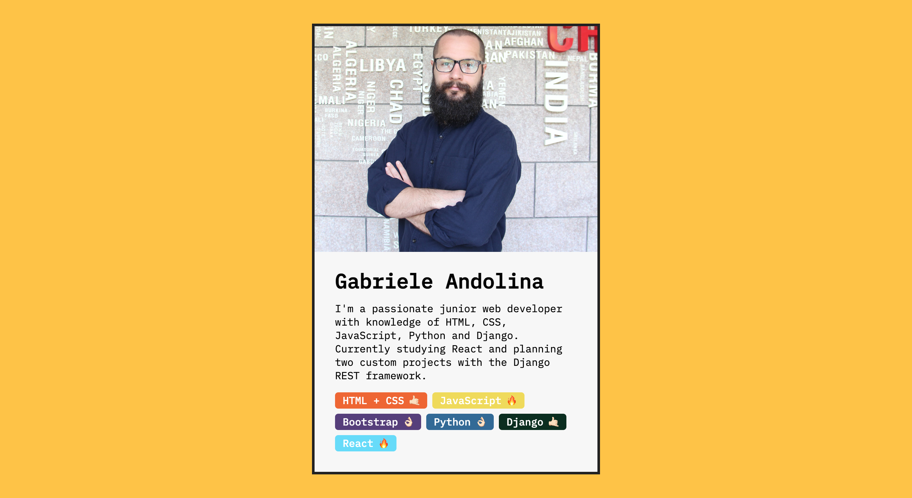
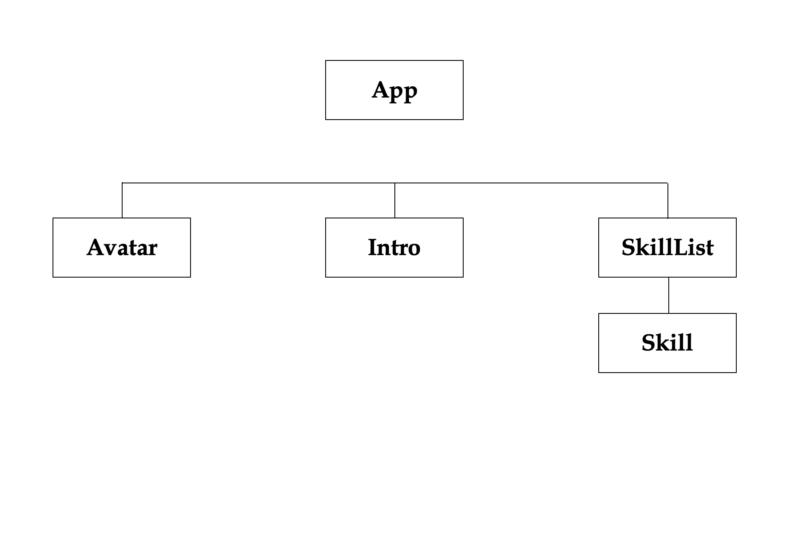

# **Challenge #1&2 - Profile Card**

This small project is the combination of the first two challenges in "The Ultimate React Course 2023: React, Redux & More" by Jonas Schmedtmann. 

## **1. Practiced Skills**

The goal of the challenge is to get some practice creating components and passing props to them.

## **2. Component Tree**

Other than the main App function, the app is composed of four components:
- Avatar: the developer's photo;
- Intro: the developer's name and small bio/introduction;
- SkillList (parent component): the list of all the skills of the developer; 
- Skill (child component): the specific skill, made up of the technology/skill name and an emoji to show the level of proficiency for each one.